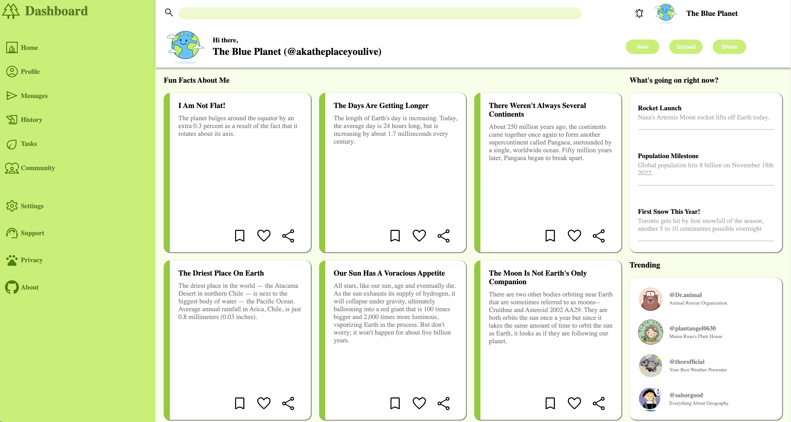

# Admin-Dashboard

# ShowCase

# Author

Created by Gary Shi(@montage0921) with guidance of The Odin Project

# Sources

1. Icons and The Page Logo

   All icons and the page logo comes from Google Fonts (https://fonts.google.com/icons)

2. Content in "FUN Facts About Me"

   All contents in this section are from NASA's article <b>"10 interesting things about Earth"</b>
   (https://climate.nasa.gov/news/2469/10-interesting-things-about-earth/)

3. Avatars

   Avatars used in this web page comes from a variety of sources. All pictures used are searched from Google Image.

   1. The cartoon earth avatar

      https://www.istockphoto.com/vector/cute-cartoon-earth-gm1050787688-280958022

   2. Avatar pictures used in trending section

      1. https://www.iconfinder.com/icons/4043234/animal_avatar_bear_russian_icon

      2. https://www.pinterest.es/pin/385198574390376933/?mt=login

      3. https://www.pinterest.com/pin/707768897692652589/

      4. https://www.istockphoto.com/vector/flat-round-avatar-of-schoolboy-my-favorite-subject-is-geography-gm1056000904-282207729
